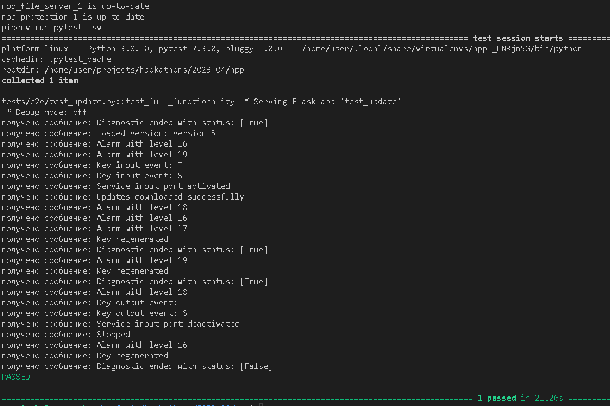

# Условия использования 

Применять только в учебных целях. Данных код может содержать ошибки, авторы не несут никакой ответственности за любые последствия использования этого кода.
Условия использования и распространения - MIT лицензия (см. файл LICENSE).

## Настройка и запуск

### Системные требования

Данный пример разработан и проверен на ОС Ubuntu 20.04.5, авторы предполагают, что без каких-либо изменений этот код может работать на любых Debian-подобных OS, для других Linux систем, а также для MAC OS необходимо использовать другой менеджер пакетов. В Windows необходимо самостоятельно установить необходимое ПО или воспользоваться виртуальной машиной с Ubuntu (также можно использовать WSL версии не ниже 2).

### Используемое ПО

Стандартный способ запуска демо предполагает наличие установленного пакета *docker*, а также *docker-compose*. Для автоматизации типовых операций используется утилита *make*, хотя можно обойтись и без неё, вручную выполняя соответствующие команды из файла Makefile в командной строке.

Другое используемое ПО (в Ubuntu будет установлено автоматически, см. следующий раздел):
- python (желательно версия не ниже 3.8)
- pipenv (для виртуальных окружений python)

Для работы с кодом примера рекомендуется использовать VS Code или PyCharm.

В случае использования VS Code следует установить расширения
- REST client
- Docker
- Python

### Настройка окружения и запуск примера

В терминале перейдите в папку проекта и выполните команду

```bash
make all
```

В результате будет создано виртуальное окружение для этого проекта, собраны необходимые docker образы, запущен пример и автоматический тест.

Вывод должен быть похож на изображённый в следующей картинке, числа могут отличаться, т.к. генерируются случайным образом.



### REST запросы

Для ручного тестирования в VS Code откройте файл requests.rest, при наведении мышкой на GET и POST запросы появится текст 'Send request', при нажатии на него запрос будет выполнен.

Логическая последовательность: start -> { key_in -> key_in -> { key_out -> key_out }} -> stop

_Start_ загрузит приложение, уставки, настройки.

_Key in_ имитирует вставление аппаратного ключа, ключей два - S - для специалиста по безопасности, T - для техника. 

Процесс обновления начинается только тогда, когда если ключа активированы.

_Stop_ останавливает все внутренние процессы и очищает значение переменных.
